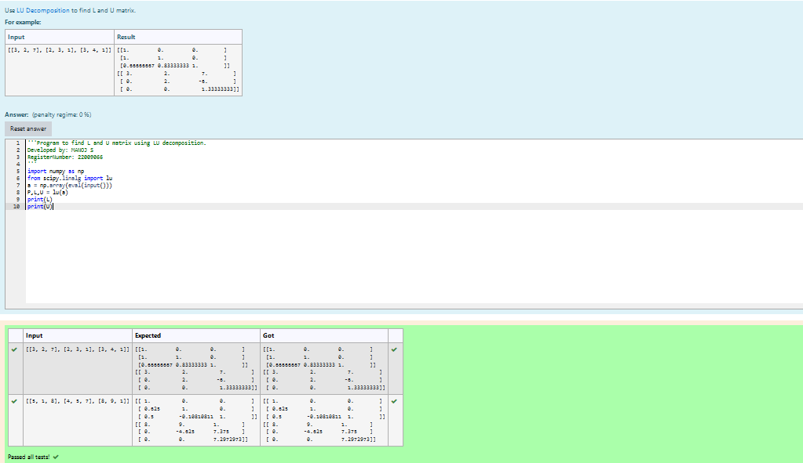
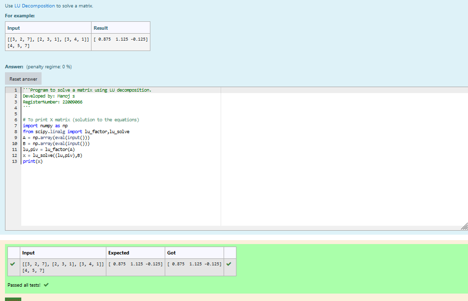

# LU Decomposition 

## AIM:
To write a program to find the LU Decomposition of a matrix.

## Equipments Required:
1. Hardware – PCs
2. Anaconda – Python 3.7 Installation / Moodle-Code Runner

## Algorithm
1. Import numpy package and scipy.linalg .  
2. Get the matrix.
3. Using lu() to find the L and U matrix.
    usingn lu_factor , lu_solve to find the lu decomposition. 
4. Print the Result.

## Program:
(i) To find the L and U matrix
```
/*
Program to find the L and U matrix.
Developed by: Manoj S
RegisterNumber: 22009066
*/
import numpy as np
from scipy.linalg import lu
a = np.array(eval(input()))
P,L,U = lu(a)
print(L)
print(U)
```
(ii) To find the LU Decomposition of a matrix
```
/*
Program to find the LU Decomposition of a matrix.
Developed by: Manoj S
RegisterNumber: 22009066
*/
import numpy as np
from scipy.linalg import lu_factor,lu_solve
A = np.array(eval(input()))
B = np.array(eval(input()))
lu,piv = lu_factor(A) 
x = lu_solve((lu,piv),B)
print(x)
```

## Output:
output 1;


output 2;




## Result:
Thus the program to find the LU Decomposition of a matrix is written and verified using python programming.

